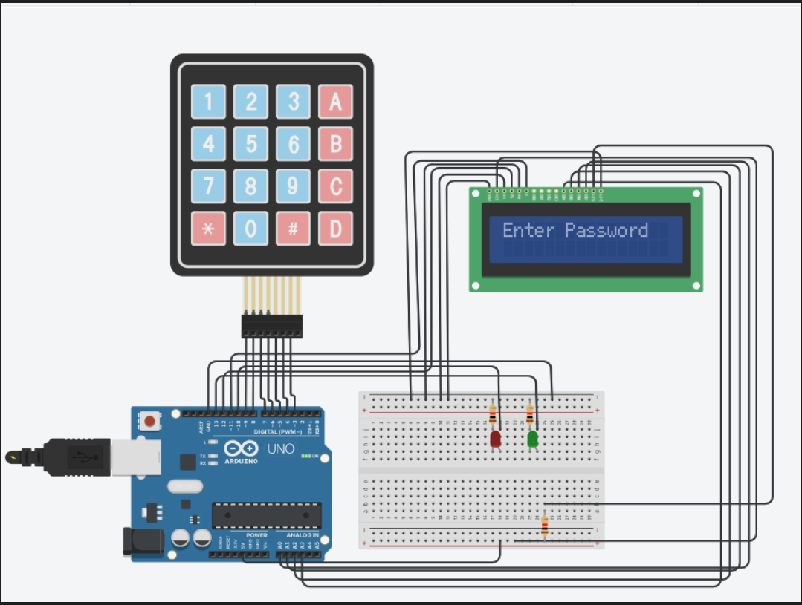

**Github Simulation link:**    
https://www.tinkercad.com/things/ggyiUgSD42C-task-1?sharecode=b2XlYcM3pI43HVLTx07D5ArmW-WmOelfik_PQUSpXNU

**Explanation of code:**  
- In the preprocessor part we include the required files liquid crystal for the display by the lcd screen  
  and keypad for the 4x4 keypad.  
- Then here im inputting a password that it will check the code we input  
  via the 4x4 keypad in real time against, this case password is 1947.  
- Setting a variable i=0, acts as a counter for the number of digits input and it checks against preset password only when i=4.  
- Making an array called code with type char to store the code we input in real time while simulation runs.  
- Initializing the keypad with all 4 rows and only 3 columns as we are not using A,B,C,D. Configuring  
  pins of arudino to rows and colums.  
- In void setup starting cursor on lcd screen from 0th row and 0th column then defining pins for leds and giving instruction to start lcd and printin "Enter Password".  
- In void loop firstly we get the key that gets input during simulation and we use an if(key) to make  
  sure garbage value doesnt come.  
- We do first lcd.clear() in case any previous access granted or denied message was running and put "Enter Password" again.  
- We make a variable t=1 in case the password is right in case it is wrong it gets switched to 0 and gives output likewise.  
- Following is the code for the two cases where the leds get lit for 1 sec and the message is displayed.  

**Code:**    
#include <LiquidCrystal.h>
#include <Keypad.h>
const int rs=12, en=11,d4=A3,d5=A2, d6=A1,d7=A0;
LiquidCrystal lcd(rs,en,d4,d5,d6,d7);

const char  pass[4]={'1','9','4','7'};
int i=0;
char code[4];
const byte ROWS=4;
const byte COLS=3;
char keys[ROWS][COLS]={
  {'1','2','3'},
  {'4','5','6'},
  {'7','8','9'},
  {'*','0','#'}};
  
  byte rowpins[ROWS]={9,8,7,6};
  byte columnpins[COLS]={5,4,3};
Keypad keypad=Keypad( makeKeymap(keys),rowpins,columnpins,ROWS,COLS);
  
  void setup(){
    
    lcd.setCursor(0,0);
    
    Serial.begin(9600);
  pinMode(13,OUTPUT);
   pinMode(10,OUTPUT);
  lcd.begin(16,2);
  lcd.print("enter password");}

  void loop(){
   

    char key=keypad.getKey();

    if(key){
    lcd.clear();
    lcd.print("enter password");
    Serial.println(key);
    code[i]=key;
      i++;}
    
    int t=1;
    if(i==4){
      for(int k=0;k<4;k++){
        if(pass[k]!=code[k]){
          t=0;}
      i=0;}
          
    if(t){
      digitalWrite(13,HIGH);
      lcd.clear();
      lcd.print("access granted");
      delay(1000);
      digitalWrite(13,LOW);
     
      
    }
      
      else{
      digitalWrite(10,HIGH);
      lcd.clear();
      lcd.print("access denied");
      delay(1000);
      digitalWrite(10,LOW);
      
      }
      }}  

**output:**    
base case  
  

